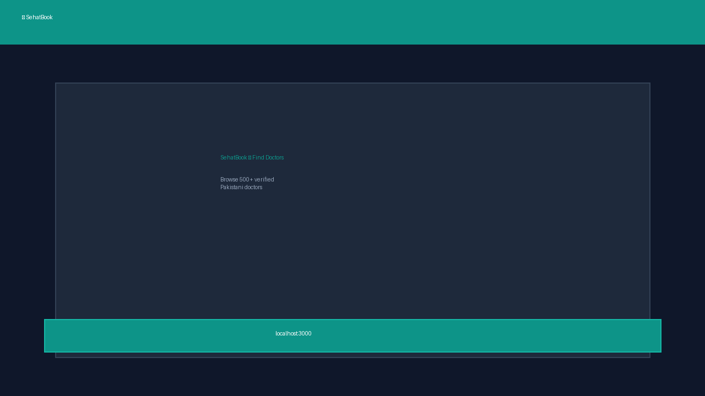
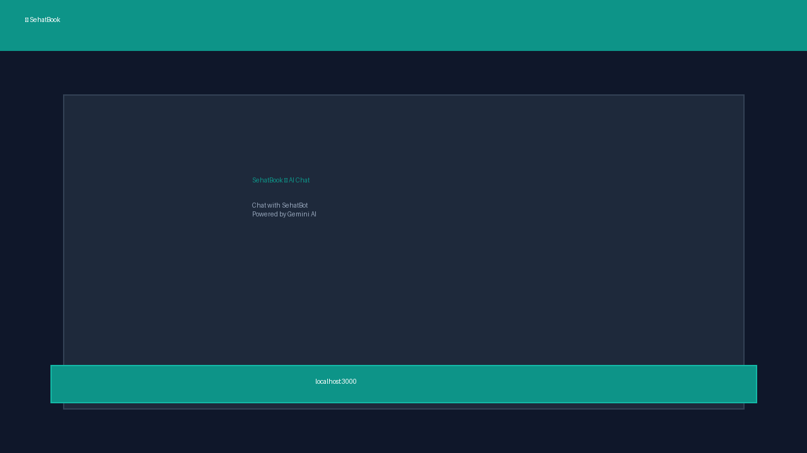

---

# 🩺 SehatBook — Pakistan Doctor Booking System

<div align="center">


**Real Pakistani doctors · AI-powered booking · 100% Free**

[](https://python.org)
[](https://fastapi.tiangolo.com)
[](https://aistudio.google.com)
[](LICENSE)

[🌐 Live Demo](#) · [📖 Docs](http://localhost:4444/docs) · [🐛 Report Bug](../../issues)

</div>

---

## 📸 Screenshots

<div align="center">

### 🏠 Home Page


### 👨‍⚕️ Find Doctors


### 🤖 AI Chat Assistant


</div>

---

## ✨ Features

- 🔍 **Search Real Doctors** — Scraped from Marham.pk across 12+ Pakistani cities
- 📅 **Book Appointments** — Pick date, time, get instant confirmation code
- 🤖 **AI Chat Assistant** — Powered by Google Gemini (free), chat in English or Urdu
- 📋 **Manage Bookings** — Check or cancel any appointment with confirmation code
- 🏙️ **12 Pakistani Cities** — Lahore, Karachi, Islamabad, Peshawar, Rawalpindi & more
- 🩺 **30+ Specializations** — Cardiologist, Dermatologist, Pediatrician and more
- 💰 **100% Free** — No paid APIs, no credit card required

---

## 🏗️ Tech Stack

| Layer | Technology |
|-------|-----------|
| Frontend | HTML5 · CSS3 · Vanilla JavaScript |
| Backend | Python · FastAPI · Uvicorn |
| Database | SQLite (sehatbook.db) |
| AI Agent | Google Gemini 2.0 Flash (Free) |
| Data | Scraped from Marham.pk using BeautifulSoup |

---

## 🚀 Quick Start

### 1. Clone the Repository
```bash
git clone https://github.com/YOUR_USERNAME/sehatbook.git
cd sehatbook
```

### 2. Install Dependencies
```bash
pip install -r requirements.txt
```

### 3. Get Free Gemini API Key
1. Go to `https://aistudio.google.com` 
2. Sign in with your Google account
3. Click **Get API Key** → **Create API Key**
4. Copy the key

### 4. Add API Key
Create a `.env` file in the project root:
```
GEMINI_API_KEY=your-gemini-key-here
```

### 5. Load Doctor Data
```bash
python database.py
```

### 6. Start the Backend
```bash
uvicorn backend:app --host 0.0.0.0 --port 4444
```

### 7. Open the Website
Double-click `index.html` or run:
```bash
python -m http.server 3000
```
Then open **http://localhost:3000** in your browser.

---

## 📁 Project Structure

```
sehatbook/
│
├── 📊 Data (Scraped Doctor Data)
│   ├── all_pakistan_doctors.csv
│   ├── pakistan_doctors_comprehensive.csv
│   ├── peshawar_doctors.csv
│   └── doctors_firecrawl.csv
│
├── 🐍 Backend
│   ├── backend.py          ← FastAPI server (port 4444)
│   ├── database.py         ← SQLite setup + CSV loader
│   ├── agent.py            ← Google Gemini AI agent
│   └── sehatbook.db        ← SQLite database (auto-created)
│
├── 🌐 Frontend
│   └── public/index.html   ← Complete single-page website
│
├── 🔧 Scrapers
│   ├── scraper.py
│
├── 📸 Screenshots
│   ├── 1_home.png
│   ├── 2_doctors.png
│   └── 3_chat.png
│
├── .env                    ← Your API key (not uploaded to GitHub)
├── .env.example            ← Template for others
├── requirements.txt
└── README.md
```

---

## 🌐 API Endpoints

The backend runs at `http://localhost:4444`

| Method | Endpoint | Description |
|--------|----------|-------------|
| GET | `/` | API status |
| GET | `/stats` | Total doctors, cities, appointments |
| GET | `/cities` | All available cities |
| GET | `/specializations` | All medical specializations |
| GET | `/doctors` | Search doctors (filter by city, spec, search) |
| GET | `/doctors/{id}/slots` | Available appointment slots |
| POST | `/book` | Book an appointment |
| GET | `/appointment/{code}` | Get appointment by confirmation code |
| DELETE | `/appointment/{code}` | Cancel appointment |
| POST | `/chat` | AI chat with Gemini |

Full API docs: [http://localhost:4444/docs](http://localhost:4444/docs)

---

## 🤖 AI Chat Examples

```
You: "I need a heart doctor in Lahore"
SehatBot: "Ji zaroor! Found 3 Cardiologists in Lahore:
           1. Dr. Ayesha Farooq — Shaukat Khanum — Rs. 2,500 ⭐4.9
           ..."

You: "Book Dr. Ayesha for tomorrow at 10am"  
SehatBot: "Please share your name and phone number to confirm."

You: "Ali Khan, 0300-1234567"
SehatBot: "✅ APPOINTMENT CONFIRMED!
           Code: PKAB1234 ← Save this!
           Dr. Ayesha Farooq — tomorrow at 10:00
           Fee: Rs. 2,500"
```

---

## 🇵🇰 Pakistani Cities Covered

Lahore · Karachi · Islamabad · Peshawar · Rawalpindi · Quetta · Multan · Faisalabad · Hyderabad · Sialkot · Gujranwala · Abbottabad

---

## 📜 License

MIT License — free to use, modify and distribute.

---

## 🙏 Acknowledgements

- Doctor data sourced from `https://www.marham.pk` 
- AI powered by `https://aistudio.google.com` (free tier)
- Built with `https://fastapi.tiangolo.com` 

---

<div align="center">
Made with ❤️ for Pakistan 🇵🇰
</div>
